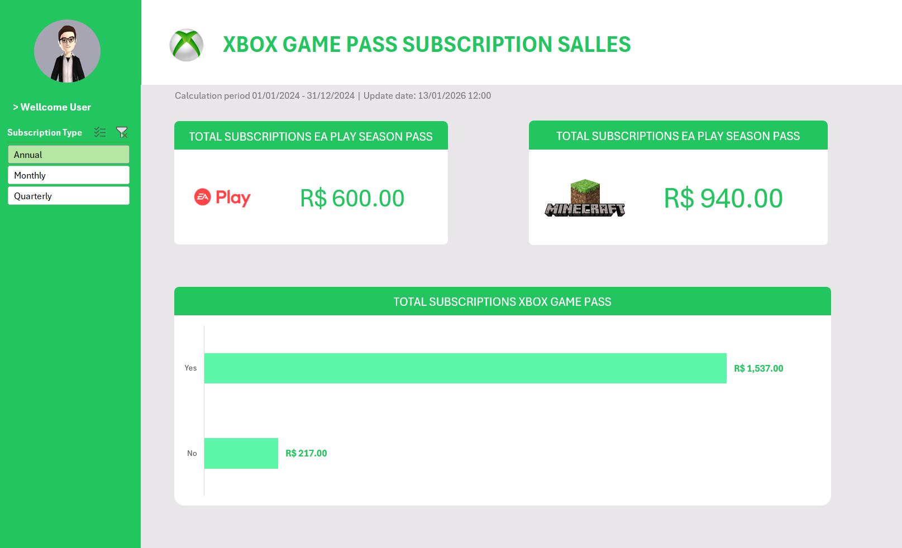

# 🎮 Xbox Game Pass Subscriptions Sales Dashboard

> A comprehensive Excel dashboard for analyzing Xbox Game Pass subscription sales, transforming raw data into actionable business insights.

[](https://opensource.org/licenses/MIT)
[]()

## Table of Contents

- [Project Overview](#project-overview)
- [Objectives](#-objectives)
- [Dataset Description](#-dataset-description)
- [Dashboard Features](#-dashboard-features)
- [Tools Used](#-tools-used)
- [Repository Structure](#-repository-structure)
- [Getting Started](#️-getting-started)
- [License](#license)

## Project Overview

This project consists of creating a **Sales Dashboard for Xbox Game Pass Subscriptions** using **Microsoft Excel**.

The main goal is to transform raw subscription data into clear, visual, and meaningful insights that support business analysis and data-driven decision-making.

The dashboard focuses on subscription plans, additional services, pricing, and total revenue generated by subscribers.



---

## 🎯 Objectives

- Organize and clean raw subscription data
- Analyze sales performance and revenue composition
- Create an interactive and visual dashboard in Excel
- Enable quick insights into subscription behavior and sales metrics

---

## 📊 Dataset Description

The dataset represents Xbox Game Pass subscribers and includes the following columns:

| Column Name | Description |
|------------|------------|
| Subscriber ID | Unique identifier for each subscriber |
| Name | Subscriber name |
| Plan | Subscription plan (e.g., Ultimate) |
| Start Date | Subscription start date |
| Auto Renewal | Indicates if auto-renewal is enabled |
| Subscription Price | Base subscription price |
| Subscription Type | Billing frequency (e.g., Monthly) |
| EA Play Season Pass | Indicates if EA Play is included |
| EA Play Season Pass Price | Price of EA Play add-on |
| Minecraft Season Pass | Indicates if Minecraft pass is included |
| Minecraft Season Pass Price | Price of Minecraft add-on |
| Coupon Value | Discount applied |
| Total Value | Final total value paid |

---

## 📈 Dashboard Features

- Total sales and revenue overview
- Breakdown of revenue by subscription plan
- Analysis of add-on services (EA Play & Minecraft)
- Auto-renewal vs non-renewal subscribers
- Monthly subscription analysis

---

## 🛠 Tools Used

**Microsoft Excel**
- Pivot Tables
- Charts and Graphs
- Slicers and Filters
- Data formatting and calculations

---

## 📂 Repository Structure

```
xbox-game-pass-subscriptions-salles-dashboard/
├── README.md
└── Xbox_Game_Pass_Subscriptions_Sales.xlsx
```

---

## ▶️ Getting Started

### Prerequisites

- Microsoft Excel (2016 or later)
- Git

### Installation & Usage

1. Clone this repository:
```bash
git clone https://github.com/your-username/xbox-game-pass-subscriptions-salles-dashboard.git
cd xbox-game-pass-subscriptions-salles-dashboard
```

2. Open the Excel file using Microsoft Excel:
```bash
Xbox_Game_Pass_Subscriptions_Sales.xlsx
```

3. Navigate to the **Dashboard** sheet to explore the visuals and insights

4. Use filters and slicers to interact with the data dynamically

---

## 📌 Notes

This project was developed as part of a data visualization and analytics challenge, focusing on Excel dashboards and business insights.

Feel free to explore, customize, and improve the dashboard to suit your analytical needs.

## License

This project is licensed under the MIT License - see the [LICENSE](LICENSE) file for details.

---

For more information, please open an issue or contact the maintainers.
